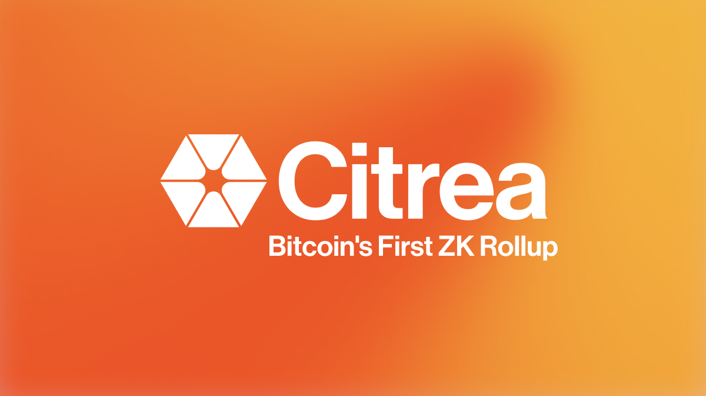

# Citrea

**The first rollup that enhances the capabilities of Bitcoin blockspace with zero-knowledge technology.**

> [!WARNING]
> Citrea is still work-in-progress. It has not been audited and should not be used in production under any circumstances. Many key features are under heavy development, and its proper integration with [Bitcoin](https://github.com/bitcoin/bitcoin) and [Clementine](https://github.com/chainwayxyz/clementine) is still ongoing. \
> \
> Please note that Citrea has not been deployed to Bitcoin or any other network. \
> \
> Follow our website & social media accounts for announcements regarding testnet & mainnet phases of Citrea. Also, do not forget that Citrea **does not** have a token, uses <b>BTC</b> as its native token. \
> \
> Please be aware of scams!

## What is Citrea?

Citrea is the first rollup that enhances the capabilities of Bitcoin blockspace with zero-knowledge technology, making it possible to build everything on Bitcoin.

Every transaction occuring on Citrea, is fully secured by zero-knowledge proofs and optimistically verified by Bitcoin. The execution environment of Citrea is trustless with respect to Bitcoin and is accessible to all participants of the Bitcoin Network.

Citrea's vision is to build scalable infrastructure that advances Bitcoin into its next phase, foundation for world's finance. Citrea represents Bitcoin Security at Scale with its execution shard that keeps the settlement and data availability on-chain, on-Bitcoin.

## FAQ

| Question                                         | Answer                                                                                                                      |
| ------------------------------------------------ | --------------------------------------------------------------------------------------------------------------------------- |
| How do I set up the development environment?     | [dev-setup.md](./docs/dev-setup.md)                                                                                         |
| How do I run Citrea for testing and development? | [run.md](./docs/run.md)                                                                                                     |
| Where can I read more about the architecture?    | Technical docs for the repo are in progress, in the meantime refer to [our official documentation](https://docs.citrea.xyz) |

## Official Links

- [Website](https://citrea.xyz)
- [Docs](https://docs.citrea.xyz)
- [Blog](https://blog.citrea.xyz)
- [X](https://x.com/citrea_xyz)
- [Discord](https://discord.citrea.xyz)

## Acknowledments

- [Sovereign SDK](https://github.com/Sovereign-Labs/sovereign-sdk):
- [Reth](https://github.com/paradigmxyz/reth):
